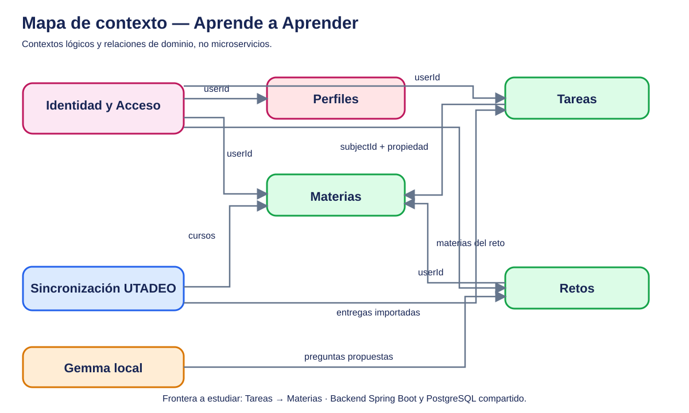
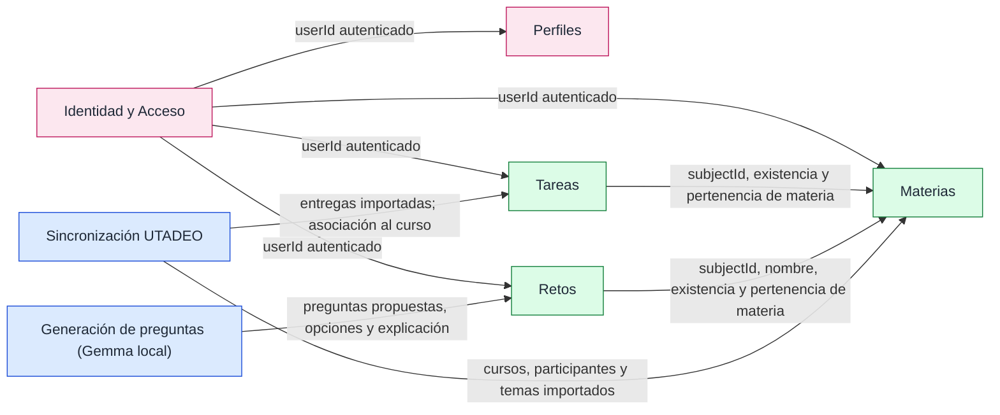

# Context Map — Aprende a Aprender (Módulo 5)

El mapa presenta **fronteras lógicas de dominio**, no contenedores desplegados por separado. El backend es un Spring Boot con `JdbcClient` y base PostgreSQL compartida. El diagrama de interacción con Android, Gemma y UTADEO puede consultarse en [C4](../c4/README.md); aquí, como en UTrabajo, se destacan **relaciones entre responsabilidades**.

## Semántica de relaciones observadas

| Proveedor lógico | Consumidor | Qué cruza la frontera | Evidencia del código / finalidad |
| --- | --- | --- | --- |
| Identidad y Acceso | Perfiles, Materias, Tareas, Retos | `Authentication.getName()` como usuario autenticado | Los controladores usan la identidad para limitar acceso a datos propios. |
| Materias | Tareas | `subjectId` y pertenencia al usuario | `TaskController.create` valida materia propia con `INSERT ... SELECT FROM subject`. Las lecturas unen `task` con `subject`. |
| Materias | Retos | materias propias, `subjectId` y `name` | `ChallengeController.today` crea avances por materia; `questions` usa `JOIN subject`; `saveQuestions` valida propiedad. |
| Sincronización UTADEO | Materias | cursos, docentes, participantes | `SubjectController.syncUtadeo` mediante `PUT /api/subjects/utadeo/sync`. |
| Sincronización UTADEO | Tareas | entregas externas, `courseId`, `assignmentId` | `TaskController.syncUtadeo` resuelve la materia por `utadeo_id` y mantiene tareas importadas. |
| Generación de preguntas | Retos | pregunta, cuatro opciones, respuesta correcta y explicación | `GemmaChallengeService.kt`, `ChallengeRepository.kt`, `PUT /api/challenges/today/subjects/{subjectId}/questions`. El cliente persiste mediante API. |

**Frontera elegida para el Spike 1: Tareas → Materias.** La creación de tareas consulta hoy la tabla `subject` directamente desde `TaskController`. Esto evidencia dependencia por esquema compartido, comparable metodológicamente —no funcionalmente— con Mensajería → Ofertas en UTrabajo.

**Pregunta:** ¿conviene mantener la comprobación de materia dentro de la transacción actual, explicitarla mediante un contrato síncrono de dominio, o replicar la información de materias mediante eventos? El contraste se desarrolla en [integración](../integracion/sincrono-vs-asincrono.md).

## Regla de interpretación

La flecha significa que el consumidor **necesita información cuya regla pertenece al proveedor**; no significa llamada HTTP interna, microservicios ni comunicación asíncrona implementada. Algunas relaciones se resuelven actualmente con JDBC/JOIN sobre PostgreSQL. El diagrama editable está en [PlantUML](context-map.puml).
