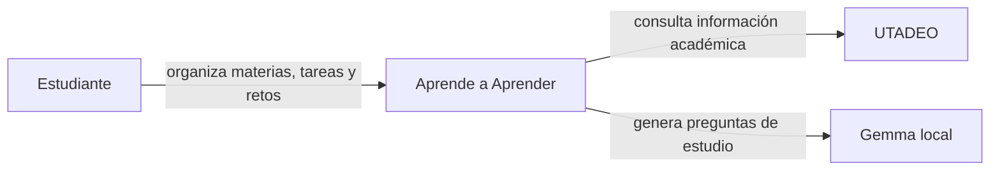

# 05 — C4 Nivel 1: contexto

En este nivel no mostramos clases ni detalles internos. Solo quién usa el sistema y con qué sistemas externos se relaciona.

## Qué representa cada elemento

| Elemento | Qué representa | Evidencia |
| --- | --- | --- |
| Estudiante | usuario principal de la aplicación | pantallas y navegación Android |
| Aprende a Aprender | sistema que estamos estudiando | `app/` + `backend/` |
| UTADEO | sistema académico externo | `UtadeoService.kt` y `UtadeoRepository.kt` |
| Gemma local | modelo usado para generar preguntas en el dispositivo | `GemmaModelManager.kt` y `GemmaChallengeService.kt` |

## Corrección hecha al contexto

En una versión anterior aparecía un **Administrador**. Lo quitamos porque no encontramos un caso de uso administrativo implementado que pudiéramos demostrar en el repositorio.

También dejamos Gemma como parte local del sistema Android, no como un servicio remoto del backend.
