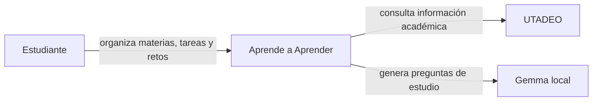

# 05 — C4 Nivel 1: contexto

El diagrama de contexto muestra el actor principal, el sistema estudiado y los sistemas externos o locales relevantes con los que se relaciona.

## Elementos representados

| Elemento | Responsabilidad | Evidencia |
| --- | --- | --- |
| Estudiante | usuario principal de la aplicación | pantallas y navegación Android |
| Aprende a Aprender | sistema estudiado | `app/` + `backend/` |
| UTADEO | sistema académico externo | `UtadeoService.kt` y `UtadeoRepository.kt` |
| Gemma local | generación de preguntas en el dispositivo | `GemmaModelManager.kt` y `GemmaChallengeService.kt` |

## Correcciones registradas

**Administrador — eliminado.** Aparecía en una versión anterior del contexto, pero no se encontró un caso de uso administrativo implementado y trazable.

**Gemma — corregido.** Se representa como capacidad local del cliente Android y no como un servicio remoto del backend.
