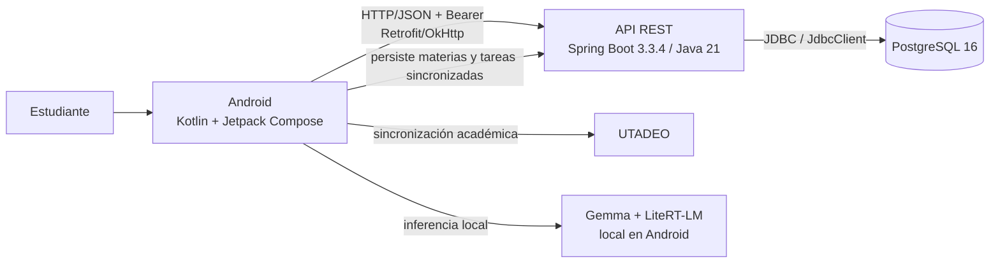
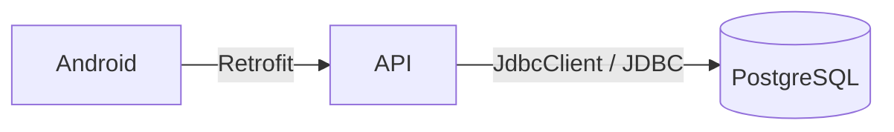

# 06 — C4 Nivel 2: contenedores

Acá mostramos las partes ejecutables o de almacenamiento que sí existen en el proyecto.

## Contenedores que sí podemos mostrar en código

| Contenedor | Archivo o módulo que lo demuestra |
| --- | --- |
| Android | `app/src/main/` |
| API REST | `backend/src/main/java/com/example/aprendeaprender/api/` |
| PostgreSQL 16 | `docker-compose.yml` y `application.yml` |
| Gemma local | `app/src/main/java/com/example/aprendeaprender/data/ai/` |
| UTADEO | `UtadeoService.kt` |

## Relación principal de persistencia

Android no conoce la contraseña de PostgreSQL ni ejecuta SQL. Esa frontera es una de las relaciones que sí tenemos que poder defender con código.

Flyway no aparece como un contenedor aparte porque no recibe peticiones de la aplicación. Se usa para crear y evolucionar el esquema cuando levanta el backend.
