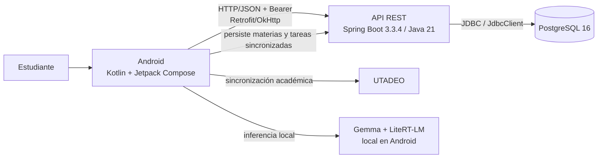
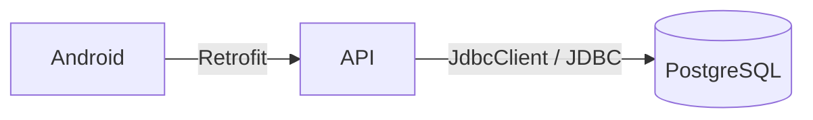

# 06 — C4 Nivel 2: contenedores

El nivel de contenedores representa las unidades ejecutables y de almacenamiento verificadas en el proyecto.

## Evidencia por contenedor

| Contenedor | Archivo o módulo |
| --- | --- |
| Android | `app/src/main/` |
| API REST | `backend/src/main/java/com/example/aprendeaprender/api/` |
| PostgreSQL 16 | `docker-compose.yml` y `application.yml` |
| Gemma local | `app/src/main/java/com/example/aprendeaprender/data/ai/` |
| UTADEO | `UtadeoService.kt` |

## Frontera de persistencia

Android no contiene credenciales de PostgreSQL ni ejecuta SQL. La persistencia se realiza exclusivamente a través de la API.

Flyway no se modela como contenedor independiente porque no recibe peticiones de negocio; se utiliza para crear y evolucionar el esquema al iniciar el backend.
