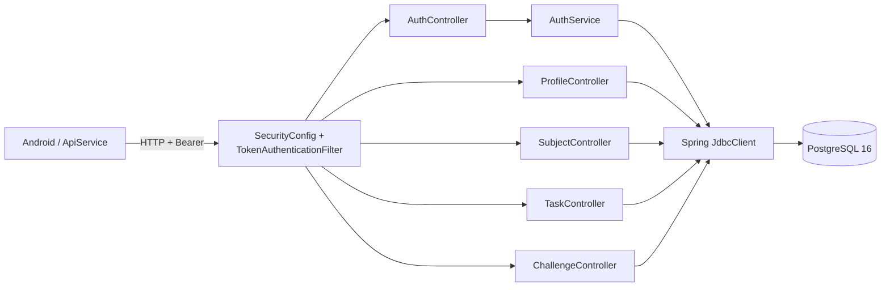
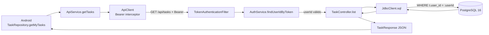
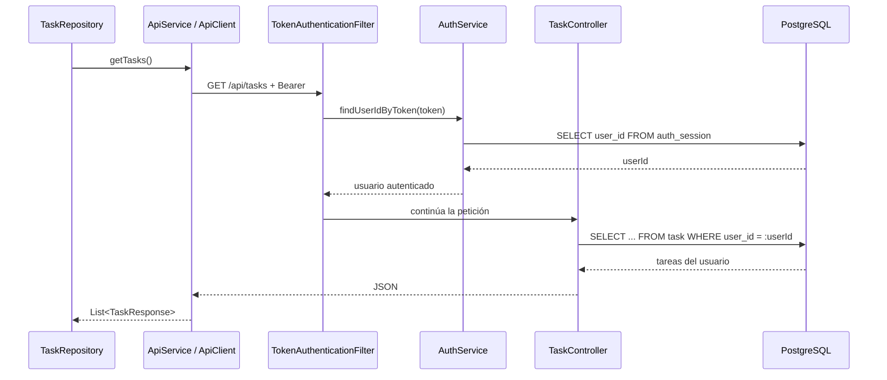

# 07 — C4 Nivel 3: componentes y trazabilidad

Para el Nivel 3 bajamos al backend porque ahí es donde se ven mejor las fronteras entre seguridad, endpoints y persistencia.

## Tabla de trazado

| Elemento C4 | Responsabilidad | Archivo / módulo real | Clase o símbolo | Relación comprobada | Estado |
| --- | --- | --- | --- | --- | --- |
| Aplicación Android | consumir la API y mostrar datos | `app/src/main/` | `ApiService`, `ApiClient` | → API REST | ✅ Verificado |
| Seguridad | validar peticiones protegidas | `SecurityConfig.java`, `TokenAuthenticationFilter.java` | `securityFilterChain`, `doFilterInternal` | → `AuthService.findUserIdByToken` | ✅ Verificado |
| AuthController | endpoints de registro y sesión | `AuthController.java` | `register`, `login`, `me`, `logout` | → `AuthService` | ✅ Verificado |
| AuthService | reglas de autenticación y sesiones | `AuthService.java` | `login`, `register`, `createSession` | → `JdbcClient` | ✅ Verificado |
| ProfileController | perfil | `ProfileController.java` | `get`, `update` | → `JdbcClient` | ✅ Verificado |
| SubjectController | materias y sincronización | `SubjectController.java` | `list`, `create`, `syncUtadeo` | → `JdbcClient` | ✅ Verificado |
| TaskController | tareas | `TaskController.java` | `list`, `create`, `updateStatus`, `delete` | → `JdbcClient` | ✅ Verificado |
| ChallengeController | retos | `ChallengeController.java` | `today`, `complete`, `questions` | → `JdbcClient` | ✅ Verificado |
| PostgreSQL 16 | persistencia | `docker-compose.yml` | servicio `db` | recibe JDBC desde API | ✅ Verificado |
| Backend Repository de tareas | capa que se había asumido | — | — | no existe | 🗑️ Eliminado |
| JDBC / Flyway como componente único | persistencia en tiempo de ejecución | — | — | eran responsabilidades distintas | ✏️ Corregido |

## Registro de correcciones

### Corregido: JDBC / Flyway

Antes aparecían juntos como si fueran un componente que recibía todas las llamadas.

Después de revisar el backend vimos que los controladores usan `JdbcClient` en tiempo de ejecución. Flyway solo administra las migraciones del esquema.

### Eliminado: repositories del backend

Tenemos repositories en Android, pero `TaskController`, `SubjectController`, `ProfileController` y `ChallengeController` no delegan en repositories del backend. Ejecutan SQL con `JdbcClient` directamente.

### Eliminado del modelo activo: OpenRouter

`OpenRouterService.kt` existe, pero al seguir el flujo actual de retos desde `ChallengeRepository` encontramos `GemmaChallengeService` → `GemmaModelManager`. Por eso no usamos solo la existencia del archivo para dibujarlo como parte activa del C4.

---

# Walking Skeleton Trace — consultar tareas

La operación que vamos a seguir es:

`GET /api/tasks`

No escogimos una operación inventada para el diagrama. Es la misma que usamos en el experimento de rendimiento.

## Vista gráfica del recorrido

## La misma ejecución como secuencia

## Salto por salto

| Paso | Qué pasa | Archivo que lo prueba | Símbolo |
| ---: | --- | --- | --- |
| 1 | Android pide las tareas | `TaskRepository.kt` | `getMyTasks()` |
| 2 | Retrofit define el endpoint | `ApiService.kt` | `@GET("api/tasks")` |
| 3 | el cliente agrega Bearer | `ApiClient.kt` | interceptor de OkHttp |
| 4 | backend toma el Bearer | `TokenAuthenticationFilter.java` | `doFilterInternal(...)` |
| 5 | el token se resuelve a usuario | `AuthService.java` | `findUserIdByToken(...)` |
| 6 | Spring entra al endpoint | `TaskController.java` | `list(Authentication auth)` |
| 7 | se ejecuta la consulta | `TaskController.java` | `jdbc.sql(...)` |
| 8 | se filtra al usuario | `TaskController.java` | `WHERE t.user_id = :userId` |
| 9 | PostgreSQL devuelve las filas | `V1__esquema_relacional.sql` | tabla `task` e índice `idx_task_user` |
| 10 | Android convierte la respuesta | `TaskRepository.kt` | `map(::toModel)` |

## Frontera donde ubicamos el dato de rendimiento

El p95 que medimos para `GET /api/tasks` pertenece al recorrido HTTP completo del experimento: autenticación, controlador, consulta JDBC, PostgreSQL y serialización de la respuesta.

La línea base fue **90,7544952 ms** para el escenario medido. Ese número no demuestra cuál de esos saltos consume más tiempo. Para saber eso tendríamos que instrumentar cada frontera por separado.
