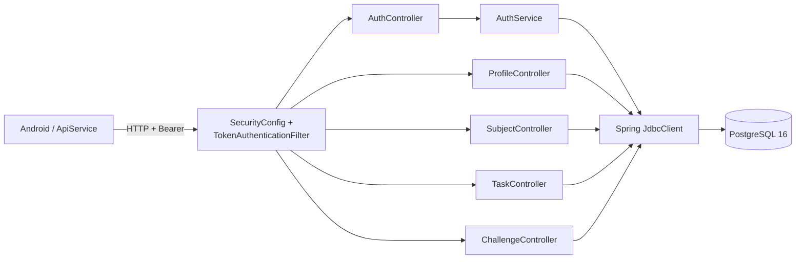
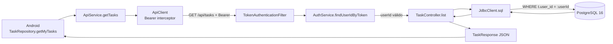
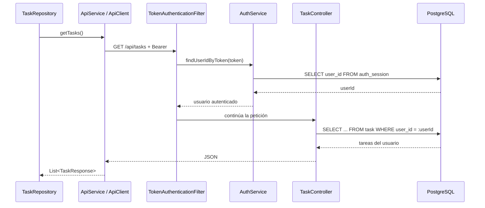

# 07 — C4 Nivel 3: componentes y trazabilidad

El nivel de componentes detalla las responsabilidades internas relevantes del backend y sus relaciones con seguridad y persistencia.

## Tabla de trazado

| Elemento C4 | Responsabilidad | Archivo / módulo real | Clase o símbolo | Relación comprobada | Estado |
| --- | --- | --- | --- | --- | --- |
| Aplicación Android | consumir la API y transformar respuestas | `app/src/main/` | `ApiService`, `ApiClient` | → API REST | ✅ Verificado |
| Seguridad | validar peticiones protegidas | `SecurityConfig.java`, `TokenAuthenticationFilter.java` | `securityFilterChain`, `doFilterInternal` | → `AuthService.findUserIdByToken` | ✅ Verificado |
| AuthController | exponer registro y gestión de sesión | `AuthController.java` | `register`, `login`, `me`, `logout` | → `AuthService` | ✅ Verificado |
| AuthService | autenticación y sesiones | `AuthService.java` | `login`, `register`, `createSession` | → `JdbcClient` | ✅ Verificado |
| ProfileController | gestión de perfil | `ProfileController.java` | `get`, `update` | → `JdbcClient` | ✅ Verificado |
| SubjectController | materias y sincronización | `SubjectController.java` | `list`, `create`, `syncUtadeo` | → `JdbcClient` | ✅ Verificado |
| TaskController | gestión de tareas | `TaskController.java` | `list`, `create`, `updateStatus`, `delete` | → `JdbcClient` | ✅ Verificado |
| ChallengeController | gestión de retos | `ChallengeController.java` | `today`, `complete`, `questions` | → `JdbcClient` | ✅ Verificado |
| PostgreSQL 16 | persistencia relacional | `docker-compose.yml` | servicio `db` | recibe JDBC desde la API | ✅ Verificado |
| Backend Repository de tareas | capa asumida inicialmente | — | — | no existe | 🗑️ Eliminado |
| JDBC / Flyway como componente único | persistencia en tiempo de ejecución | — | — | responsabilidades diferentes | ✏️ Corregido |

## Registro de correcciones

### JDBC / Flyway — corregido

En una versión anterior aparecían agrupados como un único componente de persistencia. La revisión del backend mostró que los controladores ejecutan consultas mediante `JdbcClient`, mientras Flyway se limita a versionar y aplicar migraciones del esquema.

### Repositories del backend — eliminados

`TaskController`, `SubjectController`, `ProfileController` y `ChallengeController` no delegan en repositories del backend. Sus operaciones de persistencia se realizan directamente con `JdbcClient`.

### OpenRouter — eliminado del modelo activo

`OpenRouterService.kt` existe en el repositorio, pero el flujo verificado desde `ChallengeRepository` utiliza `GemmaChallengeService` y `GemmaModelManager`. La existencia del archivo no constituye evidencia suficiente para representarlo como parte activa del C4.

---

# Walking Skeleton Trace — consulta de tareas

Operación trazada:

`GET /api/tasks`

## Flujo de extremo a extremo

## Secuencia de ejecución

## Trazado por salto

| Paso | Ejecución | Archivo | Símbolo |
| ---: | --- | --- | --- |
| 1 | solicitud de tareas desde Android | `TaskRepository.kt` | `getMyTasks()` |
| 2 | definición del endpoint Retrofit | `ApiService.kt` | `@GET("api/tasks")` |
| 3 | incorporación del token Bearer | `ApiClient.kt` | interceptor de OkHttp |
| 4 | lectura y validación del Bearer | `TokenAuthenticationFilter.java` | `doFilterInternal(...)` |
| 5 | resolución del token a usuario | `AuthService.java` | `findUserIdByToken(...)` |
| 6 | entrada al endpoint de tareas | `TaskController.java` | `list(Authentication auth)` |
| 7 | ejecución de SQL | `TaskController.java` | `jdbc.sql(...)` |
| 8 | aislamiento por usuario | `TaskController.java` | `WHERE t.user_id = :userId` |
| 9 | lectura de filas e índice asociado | `V1__esquema_relacional.sql` | tabla `task`, índice `idx_task_user` |
| 10 | transformación de la respuesta | `TaskRepository.kt` | `map(::toModel)` |

## Relación con la medición de rendimiento

El p95 registrado para `GET /api/tasks` corresponde al recorrido HTTP completo del experimento: autenticación, controlador, acceso JDBC, PostgreSQL y serialización de respuesta.

La línea base observada fue **90,7544952 ms** bajo las condiciones documentadas. Ese valor no permite atribuir el tiempo a un componente específico; para hacerlo sería necesaria instrumentación adicional por frontera.
